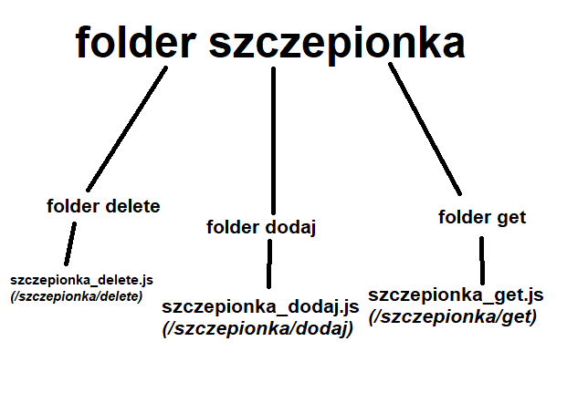

# Paszport szczepionkowy - backend
## Instalacja i konfiguracja

> **npm install** - instaluje biblioteki  
> **npm start** - startuje backend  
> W **pliku dotenv** znajduje się konfiguracja najważniejszych wartości.  
## Szablon
##### Wszystkie endpointy znajdują się w folderze route.

**Przykład**: endpoint */szczepionka*  

Przy szczepionce dodajemy kolejne endpointy np. /dodaj /get /delete 
Końcowo otrzymamy endpointy /szczepionka/dodaj, /szczepionka/get, itd.

Struktura folderów wyglada następująco:

#### Językiem przewodnim jest angielski.
